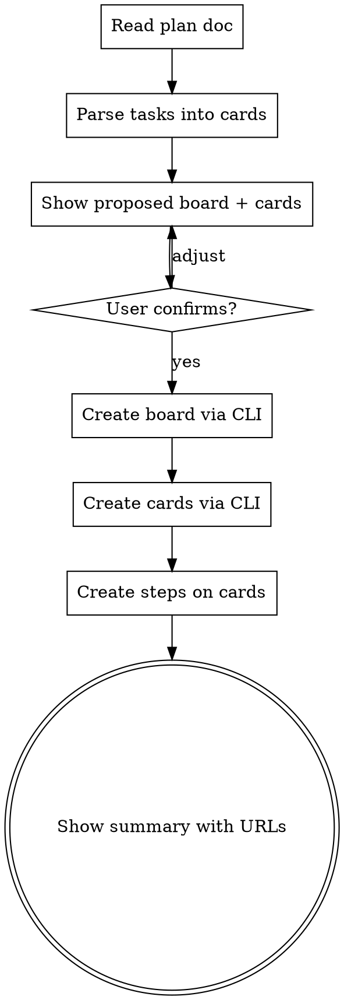

# Fizzy Plan

Create a Fizzy board and cards from an implementation plan, replacing "plan to Jira tickets" workflow.

## When to Use

- After `writing-plans` saves a plan doc
- When user says `/fizzy-plan` pointing at a plan doc
- When user asks to turn a plan into Fizzy cards/tickets

## Flow



## Parsing the Plan

Plans follow the `writing-plans` format:

- **Board name**: Extracted from `# [Feature Name] Implementation Plan` header
- **Cards**: Each `### Task N: [Component Name]` becomes a card
  - **Title**: `Task N: [Component Name]`
  - **Description**: The task's **Files** section and approach notes, formatted as HTML
  - **Steps**: Each `- [ ] **Step N: ...**` checkbox becomes a Fizzy step (to-do item) on the card

## CLI Commands

```bash
# Create board
fizzy board create --name "Feature Name"
# → returns JSON with board ID

# Create card (repeat per task)
fizzy card create --board BOARD_ID --title "Task N: Component" --description "<p>Files and details</p>"

# Create steps on card (repeat per checkbox)
fizzy step create --card CARD_NUMBER --content "Step description"
```

## Before Creating

Show the user what will be created:

```
Board: "Feature Name"

Cards:
  1. Task 1: Setup database schema
     - 5 steps
  2. Task 2: Build API endpoints
     - 4 steps
  3. Task 3: Add tests
     - 3 steps

Create this board? (y/n)
```

Wait for confirmation before running CLI commands.

## After Creating

Show summary with the board URL and card numbers for easy reference.

## Important

- All cards go into **triage** (no columns) — user organizes workflow in Fizzy
- No card assignment — user assigns as they pick up work
- Always creates a **new board** per plan
- If `fizzy` CLI is not configured, inform the user and skip gracefully
- Card descriptions should be concise — the plan doc is the source of truth
